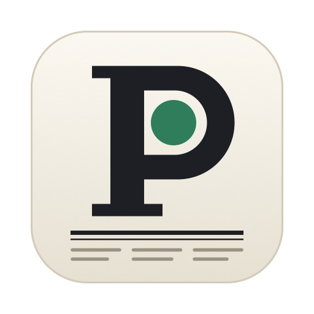
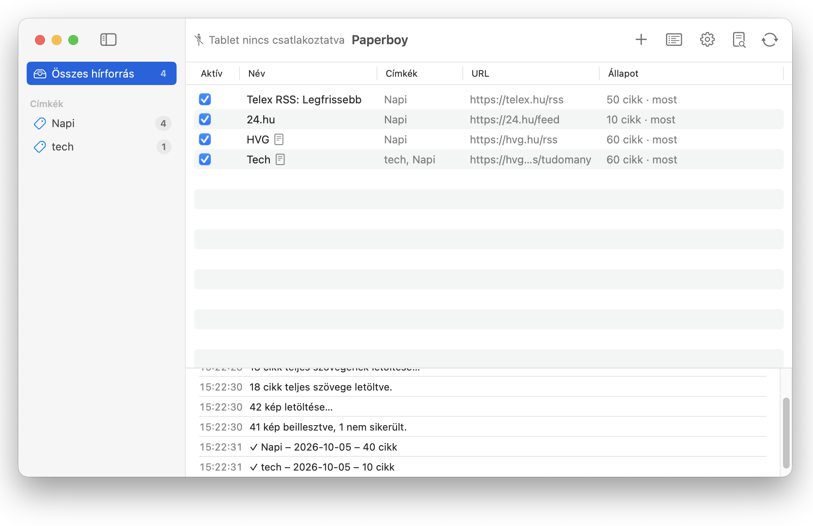
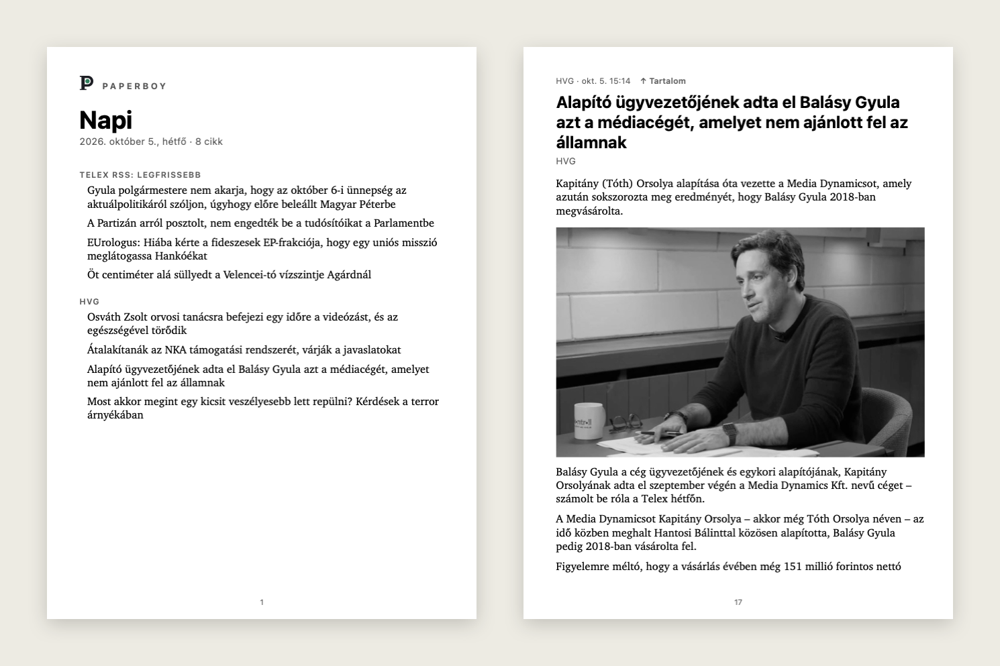

<p align="center"></p>

<h1 align="center">Paperboy</h1>

<p align="center"><b>Reggeli újság a reMarkable tabletre.</b><br>
Kedvenc hírforrásaidból minden nap egy olvasható, jegyzetelhető PDF-kiadás – magától kerül fel a tabletre, amikor bedugod.</p>

<p align="center"></p>

## Mit tud?

**Hírforrások címkékkel**
- RSS- és Atom-hírcsatornák kezelése egy listában, tetszőleges címkékkel (pl. *Napi*, *Tech*). Egy forrás több címkéhez is tartozhat.
- Új forrásnál az „Ellenőrzés” lekéri a csatornát, kitölti a nevét, és megmondja, hány cikket talált.
- Forrásonként ki-be kapcsolható; az oldalsávban címke szerint szűrhető.

**Napi kiadás címkénként**
- Minden címkéből egy PDF készül `Napi – 2026-10-05` néven, a reMarkable képernyőjére méretezve.
- A címoldalon kattintható tartalomjegyzék, minden cikk új oldalon kezdődik, és mindegyikről vissza lehet ugrani a tartalomhoz.
- Csak a még fel nem töltött cikkek kerülnek bele, így nincs ismétlődés. Beállítható, hány cikk és milyen régi hírek kerüljenek be.

<p align="center"></p>

**Teljes cikkek, képekkel**
- Sok hírcsatorna csak egy-két mondatos kivonatot ad. Forrásonként bekapcsolható, hogy a Paperboy a cikk weboldaláról töltse le a teljes szöveget – a Firefox olvasó nézetéből ismert [Mozilla Readability](https://github.com/mozilla/readability) segítségével, a menük, ajánlók és megosztógombok nélkül.
- A képek e-ink-barát módon kerülnek be: szürkeárnyalatosan, a tablet felbontására kicsinyítve, képaláírásokkal. A követőpixeleket, ikonokat és szerzői fotókat kiszűri.

**Automatikus szinkronizálás**
- A tablet csatlakoztatását magától észleli, és feltölti az aznapi kiadásokat a tablet megadott mappájába.
- Alapból naponta egyszer, reggel 6-tól; beállítható minden csatlakozásra is.
- A háttérben, a menüsorban fut; indulhat bejelentkezéskor, és értesítést küld, amikor friss hírek kerültek fel.
- Előnézet: a kiadások tablet nélkül, helyben is elkészíthetők és megnézhetők.

## Követelmények

- macOS 14 (Sonoma) vagy újabb, Swift 5.10+ (Xcode vagy Command Line Tools)
- reMarkable 2 vagy Paper Pro, USB-kábel

## Telepítés

**Kész alkalmazás:** a [Releases](https://github.com/plyk/paperboy/releases) oldalról töltsd le a legújabb `Paperboy-X.Y.Z.zip`-et, csomagold ki, és húzd a `Paperboy.app`-ot az Alkalmazások mappába. Az alkalmazás nincs Apple-fejlesztői tanúsítvánnyal aláírva, ezért első indításkor a macOS letiltja: ilyenkor a Rendszerbeállítások → Adatvédelem és biztonság alján válaszd a „Megnyitás mindenképp” lehetőséget.

**Forrásból:**

```sh
git clone git@github.com:plyk/paperboy.git
cd paperboy
./scripts/build-app.sh            # → build/Paperboy.app
cp -R build/Paperboy.app /Applications/
```

Fejlesztéshez `swift run` is elég.

## Első lépések

1. **A tableten:** Beállítások → Tárhely → kapcsold be az **USB web interface**-t, és hozd létre a célmappát (alapból `Hírek`).
2. **A Paperboyban:** add hozzá a hírforrásokat a **+** gombbal, és címkézd fel őket. Címke nélküli forrás az „Egyéb” kiadásba kerül.
3. **Próbáld ki** az **Előnézet** gombbal, majd dugd be és oldd fel a tabletet – a szinkronizálás magától elindul.
4. A **Beállításokban** (⌘,) állítható a célmappa, a cikkek száma, a képek, a teljes szöveg és az automatikus frissítés, valamint az indítás bejelentkezéskor.

## Verziók és kiadások

A verziók [szemantikus verziózást](https://semver.org/lang/hu/) követnek, és `vX.Y.Z` git-címkék jelölik őket. A build script a legutóbbi címkéből írja be a verziót az alkalmazásba, a build-szám pedig a commitok száma; mindkettő látszik a Beállítások alján és a Névjegy ablakban.

Új kiadás a `main` ágról, minden változás commitolása és pusholása után:

```sh
./scripts/release.sh 0.2.0
```

A script létrehozza a `v0.2.0` címkét, elkészíti az alkalmazást, és GitHub Release-t ad ki a letölthető zippel. A kiadási jegyzetet az előző címke óta készült commitokból állítja össze (új funkciók, javítások, egyéb).

## Tudnivalók

- A feltöltés a tablet **USB web interface**-én keresztül történik (`10.11.99.1`), felhő és fiók nélkül. Ez a felület nem tud mappát létrehozni, és meglévő dokumentumot sem tud felülírni – ezért kell a célmappát előre létrehozni, és ezért kap egy nap második kiadása `(2)` jelölést.
- Fizetős vagy bejelentkezéshez kötött cikkeknél a hírcsatorna kivonata marad.
- Az adatok helye: `~/Library/Application Support/Paperboy/library.json`.

## Felhasznált összetevők

- [Mozilla Readability](https://github.com/mozilla/readability) 0.6.0 – Apache License 2.0 (`Support/Readability.js`, `Support/Readability-LICENSE.md`)
